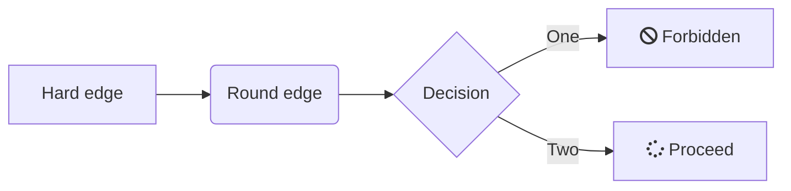
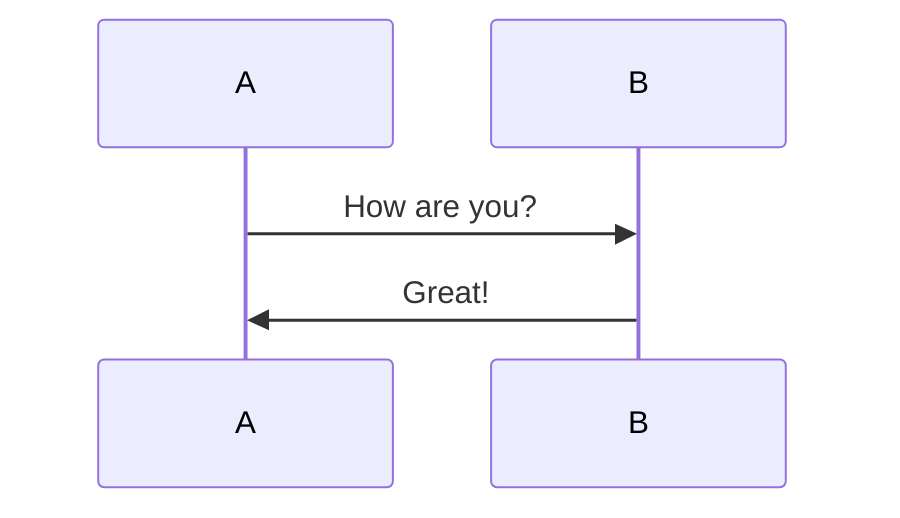
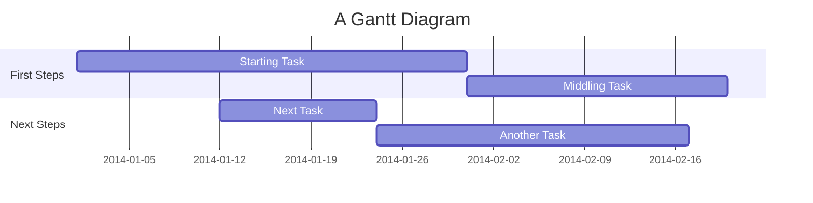
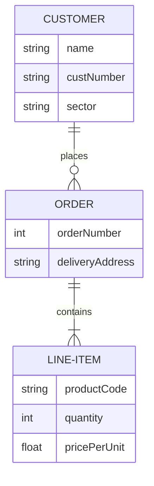
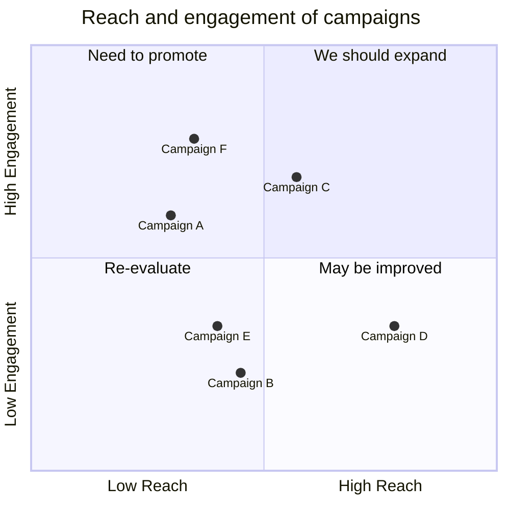
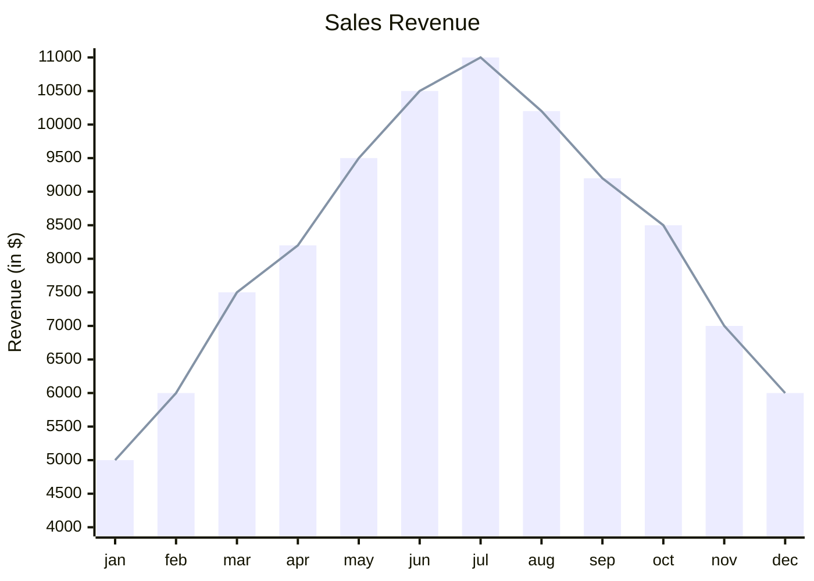

# My Markdown Demo

Hello, this is a markdown document. The key features include:

1. Open-source software
2. Text-based syntax
3. Exports to PDF and HTML

> According to [Professor Glen][1], this is a nice free, open-source program. Feel free to agree or disagree, but always provide evidence and cite your references for your claim.

[1]: https://www.coulthard.com/ "Coulthard.com"

## Section 1: Paragraphs

This is **the first content** that we'll be discussing. I have used a longer paragraph here in order to demonstrate word wrapping and how generated output will look in both HTML and PDF formats. The various notetaking programs will take different approaches to rendering and converting from markdown to PDF, but most will make use of [Pandoc](https://pandoc.org/).

## Section 2: Media

Markdown allows for the insertion of images and videos. However, the various *flavours* of markdown handle media differently, with only a few of them allowing **iframe embeds**. 

### Images


### Giphy&#46;com GIFs

<!---
The heading above uses &#46; instead of a
period to stop the automatic URL linking.
--->


### YouTube - Academic Writing in Markdown (746 x 420)

Direct link to [YouTube](https://www.youtube.com/watch?v=hpAJMSS8pvs) video.

<iframe width="746" height="420" src="https://www.youtube.com/embed/hpAJMSS8pvs" title="Academic Writing in Markdown" frameborder="0" allow="accelerometer; autoplay; clipboard-write; encrypted-media; gyroscope; picture-in-picture; web-share" allowfullscreen></iframe>

> With wider documents, use 853x480 for the iframe size.

### Vimeo iFrame (768x432 Optimal)

Direct link to [Big Buck Bunny](https://vimeo.com/1084537) video.

<iframe src="https://player.vimeo.com/video/1084537" width="768" height="432" frameborder="0" allow="autoplay; fullscreen" allowfullscreen></iframe>

### Google Map Embed

This example was taken from http://embedgooglemap.net.

<div class="mapouter"><div class="gmap_canvas"><iframe width="600" height="500" id="gmap_canvas" src="https://maps.google.com/maps?q=7000%20College%20Way%2C%20Vernon%2C%20BC&t=&z=13&ie=UTF8&iwloc=&output=embed" frameborder="0" scrolling="no" marginheight="0" marginwidth="0"></iframe></div><style>.mapouter{position:relative;text-align:right;height:500px;width:600px;}.gmap_canvas {overflow:hidden;background:none!important;height:500px;width:600px;}</style></div>

## Section 3: Code

Here is some bash script for you to review. Remember to use `sudo` for these commands.

```bash
# First, update your system
sudo apt update
sudo apt -y upgrade
# Now let's install some stuff
sudo apt install curl wget htop neofetch
```

Notice the HTML's syntax highlighting.

```html
<h1>Hello World</h1>
<p class="Tidy">This is an html paragraph and list.</p>
<ul>
    <li>One</li>
    <li>Two</li>
</ul>
<a href="http://www.coulthard.com">Coulthard.com</a>
```

## Section 4: Diagrams

### Use Mermaid Maps

Now for a flowchart diagram with font-awesome icons.



How about a simple mermaid sequence diagram?



And, here is a mermaid gantt diagram.








### Use Markmap for Mindmapping

```markmap
# Markmap

## Links

- <https://markmap.js.org/>
- [Go to GitHub](https://github.com/gera2ld/markmap)

## Features

- Add hyperlinks
- Use **inline** ~~text~~ *styles*
- Write multi-line
  text entries
- Insert `inline code`
```

### Add ABC music notation

```abc
X:1
T:Speed the Plough
M:4/4
C:Trad.
K:G
|:GABc dedB|dedB dedB|c2ec B2dB|c2A2 A2BA|
GABc dedB|dedB dedB|c2ec B2dB|A2F2 G4:|
|:g2gf gdBd|g2f2 e2d2|c2ec B2dB|c2A2 A2df|
g2gf g2Bd|g2f2 e2d2|c2ec B2dB|A2F2 G4:|
```

> - More information about **sequence diagrams** syntax [here](http://bramp.github.io/js-sequence-diagrams/).
> - More information about **flow charts** syntax [here](http://adrai.github.io/flowchart.js/).
> - More information about **graphviz** syntax [here](http://www.tonyballantyne.com/graphs.html)
> - More information about **mermaid** syntax [here](http://mermaid-js.github.io/mermaid)
> - More information about **abc** syntax [here](http://abcnotation.com/learn)

## Section 5: Tables, Checklists, and Math

### Tables

Tables are straightforward and colons can be used to align columns.

| Tables   | Are           | Cool  |
| -------- |:-------------:| -----:|
| col 3 is | right-aligned | $1600 |
| col 2 is | centered      | $12   |
| col 1 is | left-aligned  | $1    |

### Check Lists

What do I need to do today? Well, let's prepare a task list.

- [ ] Go to the market
- [x] Vacuum the floor
- [x] Buy more wine

### Math Equations

You can render *LaTeX* mathematical expressions using **MathJax**, as on [math.stackexchange.com](http://math.stackexchange.com/), except the space after the start `$` and the space before the end `$` are not allowed in the inline math:

Inline with one `$` on either side: $f(x)$ or $E = mc^2$

$\sigma = \sqrt{ \frac{1}{N} \sum_{i=1}^N (x_i -\mu)^2}$

This equation is also inline: $p={1\over q}$ 

> _See https://upmath.me for more LaTeX equations._ 

You can also use blocks (`$$`) on either side.

This is a block equation:
$$
\sigma = \sqrt{ \frac{1}{N} \sum_{i=1}^N (x_i -\mu)^2}
$$

$$
x = {-b \pm \sqrt{b^2-4ac} \over 2a}
$$

$$
\Gamma(z) = \int_0^\infty t^{z-1}e^{-t}dt\,.
$$

## Section 6: Miscellaneous Features

### Icons, Footnotes, and Keyboard Buttons

Here are some basic emojis and a footnote[^1].  
:smile:  :beer:  :cat:  :dog: :santa: :heart:

How about a few keyboard graphics using `<kbd>`?  
PRESS: <kbd>Ctrl</kbd>+<kbd>F9</kbd> to proceed  
PRESS: <kbd>Ctrl</kbd>+<kbd>Alt</kbd>+<kbd>Del</kbd> to reboot

[^1]: Emojis are small digital images, icons, or symbols used to express an idea or emotion. Review the complete list of [GitHub Markdown Emoji Icons](https://gist.github.com/rxaviers/7360908) and from here: [GitHub Markdown Templates](https://github.com/markdown-templates/markdown-emojis).

### Definitions and Abbreviations/Acronyms

HTML
: Definition 1

CSS
: Definition 2a
: Definition 2b

*[HTML]: Hyper Text Markup Language 
*[CSS]: Cascading Style Sheet

### Using HTML Tags to Show/Hide Content

<!-- You can start the details section either "open" or "closed" -->

<details>
    <summary>What is your favourite colour?<br />    <em>Click for the correct answer</em></summary>
    <br /><p><strong>Presenting the solution:</strong></p>
        <ul><li>Green</li>
        <li>No, Blue!</li></ul>
 </details>

<details>
  <summary>Can you use markdown inside of HTML?</summary>
  <markdown>
- Yup, this is embedded.
  - _Markdown_
  </markdown>
</details>

### Admonitions and Alerts

Engage the reader with message admonitions using a QUOTE style with icon emojis.

> :notebook: **Note**: 
> This is a note about how to write documentation for cats :smiley_cat:

> :bulb: **Tip**:
> This is a :musical_note: tip about the best music to play when studying.

> :boom: **Warning**:
> This is a warning message, when your code smells like :poop:.

#### Using a Wiki Style

!!! success 
Yes, **success** :tada:

!!! info

!!! Note: This is a **Note** message :mega:

#### Using the Docusaurus Style

:::info
This is an **info** message :mega:
:::

:::warning
Watch for this lightning **warning** :zap:
:::

:::danger
Think **danger** if you smell smoke. :fire:
:::

#### Using Wiki.js Style 

Engage the reader with these message boxes.

> :notebook: **Note**
> This is a note

Here are some other blockquote styles.

> Yes, **success** :tada:
{.is-success}

> This is an **info** message :mega:
{.is-info}

> Watch for this lightning **warning** :zap:
{.is-warning}

> Think **danger** if you smell smoke. :fire:
{.is-danger}


#### Referencing a CSS Class

<div class="alert alert-success">
  <b>Wait</b>: This uses a CSS div class instead!
</div>